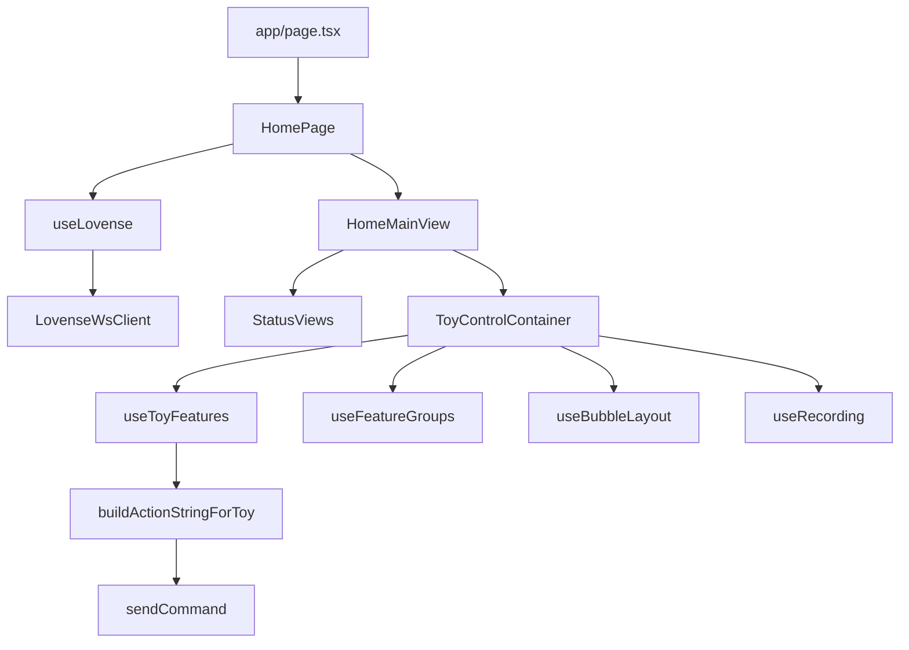

# Architecture

This document describes the current structure of the Lovense control app.

## Overview

The app is a Next.js 15 App Router client that integrates with the Lovense Connect API through server route handlers plus a WebSocket session. The user connects by scanning a rotating QR code, then controls active toys via:

- **Float mode**: drag feature bubbles vertically to set power.
- **Limits mode**: set max per-feature limits.
- **Sidebar actions**: recording/playback patterns and group reset.

Commands are serialized into Lovense action strings such as `Vibrate1:5,Rotate:10` and sent through `basicapi_send_toy_command_ts`.

## Project Layers

### 1. App + Routing (`app/`)

- `app/page.tsx` exports `HomePage`.
- `app/layout.tsx` defines root layout and global styling integration.
- `app/providers.tsx` wires Redux, VKUI providers, theme context, and i18n context.
- `app/api/**/route.ts` contains server handlers for session and Lovense token/socket bootstrapping.

### 2. UI (`components/`)

- `components/home/`: top-level screen flow (splash, onboarding, main shell, action sheets).
- `components/status/`: state-specific UI (`loading`, `error`, `qr_ready`, `online`).
- `components/ToyControlContainer.tsx`: main control surface (limits + float views, graphs, sidebar).
- `components/toy-control/`: control subcomponents such as `FloatModeControls`, `LimitControls`, `ToyGraphsPanel`, `ToyStatusBar`, `ControlSidebar`.

### 3. Runtime Hooks (`hooks/`)

- `use-lovense`: WebSocket lifecycle, QR rotation, reconnect strategy, toy discovery, command sending.
- `use-toy-features`: feature derivation, level state, max limits, throttled command dispatch.
- `use-feature-groups`: bubble merge/group state and reset.
- `use-bubble-layout`: bubble positioning, drag/fall behavior, layout reset.
- `use-recording`: capture and replay interaction patterns.

### 4. State (`store/`)

Redux Toolkit store slices:

- `connectionSlice`: connection status, qr URL, toys, errors, reconnect/session runtime.
- `selectionSlice`: active toy selection.
- `controlSlice`: control-specific UI state.
- `onboardingSlice`: onboarding progress.

### 5. Domain + Infra (`lib/`)

- `lib/lovense/`: Lovense domain types/constants/feature helpers.
- `lib/lovense-domain.ts`: compatibility re-export for Lovense domain modules.
- `lib/command-serialization.ts`: converts feature levels into Lovense action strings.
- `lib/lovense/ws-client.ts`: Socket.IO-over-WebSocket client protocol handling.
- `lib/server/lovense-api-client.ts`: server-side Lovense HTTP API calls (`getToken`, `getSocketUrl`).
- `lib/api/internal-client.ts`: browser-side internal API client helpers.

## Connection and Command Flow

1. `useLovense()` dispatches `initializeLovenseSession`.
2. `initializeLovenseSession` calls:
   - `GET /api/session` to create/refresh a signed session cookie.
   - `POST /api/lovense/socket` to exchange session identity for Lovense `authToken`.
   - `POST /api/lovense/socket-url` to exchange `authToken` for final `wsUrl`.
3. `LovenseWsClient` connects and emits/receives Socket.IO-framed messages.
4. `basicapi_get_qrcode_ts` requests QR updates while waiting for app pairing.
5. `basicapi_update_device_info_tc` updates connected toy state.
6. UI interactions update feature levels in `useToyFeatures`.
7. `buildActionStringForToy` serializes levels, and `sendCommand` emits `basicapi_send_toy_command_ts`.

## Partner mode (bridge)

When **partner mode** is enabled (e.g. user chooses "Create room" or "Join with code"), the app talks to a separate **bridge server** instead of connecting directly to Lovense. The bridge connects two participants (host and guest): each has their own Lovense session; the host controls the guest’s toys and the guest controls the host’s toys.

**Flow:**

1. **Create or join room** — Host: `POST <bridge>/rooms` → `roomId`, `pairCode`, `hostTicket`. Guest: `POST <bridge>/rooms/join` with `pairCode` → `roomId`, `guestTicket`.
2. **Register Lovense with bridge** — Frontend gets `authToken` (and optional `sessionProof`) from the app via `GET /api/session` and `POST /api/lovense/socket`, then `POST <bridge>/register-session` with `{ authToken, ticket, sessionProof? }`. The bridge calls Lovense getSocketUrl and spawns a backend tunnel (or reuses the host’s in self-pairing).
3. **WebSocket** — Client opens `wss://<bridge>/ws?ticket=<ticket>`. Same Engine.IO / Socket.IO handshake as direct Lovense; then Lovense events (device list, commands) and bridge events (partner status, toy rules, chat) are exchanged.
4. **Rules and chat** — Each side sends `bridge_set_toy_rules` (enabled toys, max power, limits) so the bridge enforces what the partner can control. Chat and typing use `bridge_chat_message`, `bridge_chat_typing`; history is replayed on connect.

**Client:** [hooks/use-bridge-session.ts](hooks/use-bridge-session.ts) — `createRoom`, `joinRoom`, `registerLovenseWithBridge`, `LovenseWsClient` with the same protocol; handles `bridge_partner_status`, `bridge_partner_toy_rules`, chat, and sends commands via `basicapi_send_toy_command_ts` and rules via `bridge_set_toy_rules`. Bridge base URL comes from `NEXT_PUBLIC_BRIDGE_SERVER_URL`.

**Contract:** See [docs/BRIDGE_SERVER_SPEC.md](docs/BRIDGE_SERVER_SPEC.md) for HTTP API, WebSocket events, and environment. The current implementation is the Cloudflare Worker in `workers/bridge/`.

## API Endpoints

**App (Next.js):**

- `GET /api/session`
  - Creates/verifies a JWT session (`lovense_session_token`) using `JWT_SECRET`.
- `POST /api/lovense/socket`
  - Verifies session JWT, then requests Lovense `authToken` with `LOVENSE_DEV_TOKEN`. In partner mode the frontend also uses this to get `authToken` and optional `sessionProof` before calling the bridge.
- `POST /api/lovense/socket-url`
  - Exchanges `authToken` for WebSocket URL and returns `wsUrl` (used in self mode only).

**Partner mode:** The frontend calls the **bridge** directly using `NEXT_PUBLIC_BRIDGE_SERVER_URL`: `POST <bridge>/rooms`, `POST <bridge>/rooms/join`, `POST <bridge>/register-session`, and `GET <bridge>/ws?ticket=...`. The app’s `GET /api/session` and `POST /api/lovense/socket` are still used to obtain `authToken` and `sessionProof` before registering with the bridge.

## Code Splitting and Performance

- `components/status/StatusViews.tsx` lazy-loads `StatusErrorView`, `StatusQrView`, and `StatusOnlineView`.
- `ToyControlContainer` lazy-loads `FloatModeControls`.
- `next.config.ts` enables production `optimizePackageImports` for `lucide-react`.
- Additional webpack chunk tuning is enabled in production client builds.

## Runtime and Deployment

- Next.js App Router runtime with React 19 and VKUI.
- OpenNext Cloudflare integration:
  - `next.config.ts` initializes OpenNext Cloudflare for dev.
  - `open-next.config.ts` defines OpenNext Cloudflare config.
  - `wrangler.jsonc` runs `.open-next/worker.js` and serves `.open-next/assets`.

## Environment Variables

- `LOVENSE_DEV_TOKEN`: Lovense developer token used server-side.
- `JWT_SECRET`: secret used to sign and verify session JWT cookies.
